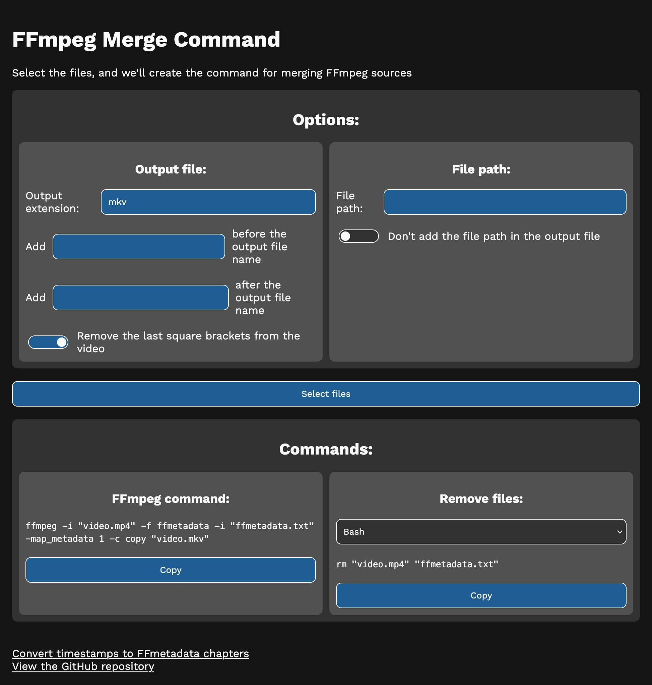

# FFmpeg Merge Command

This really simple website generates a FFmpeg script that permits to merge a
video and audio file together, by allowing also custom metadata (if passed as a
txt file). Nothing more, I just needed this and I thought that spending 20
minutes writing a HTML page was better than spending 1 minute writing commands
manually :)

Website URL: https://dinoosauro.github.io/ffmpeg-merge-command/

## Options

When you open the webpage, you'll immediately see two sections in the "Options"
card.

### Output file:

In this section you can customize:

- The output extension of the file. You can choose whatever you want, as long as
  the container actually supports both the video and the audio codec. Keeping
  `mkv` is a safe option.
- The text to add before (or after) the output file name.
- If you want to remove the last square brackets from the output file name. The
  reason for this is that I needed it, nothing else.

### File path:

In this section you can customize:

- The file path of the selected files: for example, if they are on
  `/Users/HelloWorld/Downloads/`, write this path so that FFmpeg can find them
  even if you are not in the same folder in the terminal.
- If you want to add the file path in the output file name.

Then, select the files and the script will be generated. You can copy the output
with the button.

## Privacy

Everything is elaborated locally, and nothing is sent to an external server. You
can use this webpage offline by downloading the HTML source code (the "Work
Sans" font won't be loaded, but everything else will work fine).

Settings are saved locally on your device.

## Screenshots

